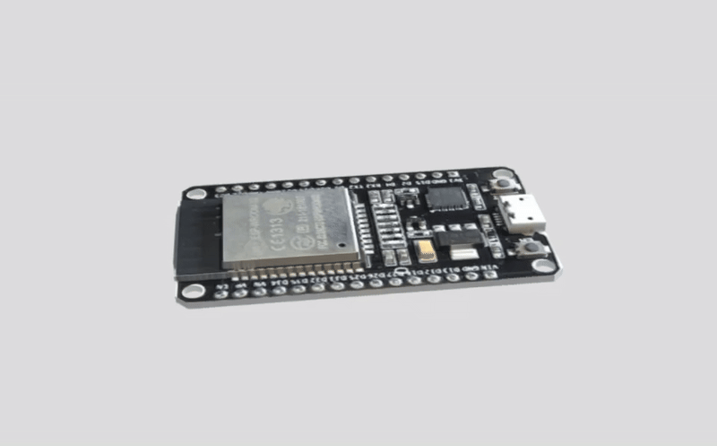
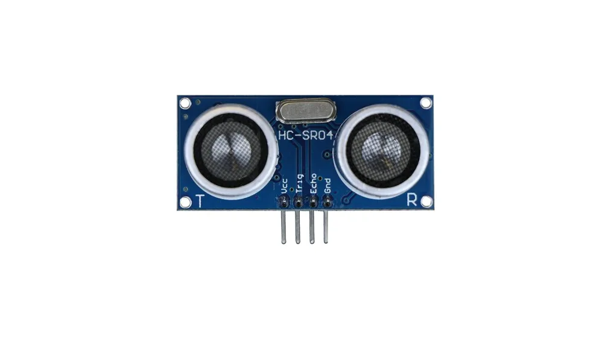

# Material
The Material we used to build our robot car
## Raspberry Pi 4

  

- **Processor**: 1.5GHz 64-bit quad-core  
- **RAM**: 8GB LPDDR4  
- **SD card**: 32GB 
- **Ports**: 2 USB 3.0 ports, 2 USB 2.0 ports
- **Operation Voltage** : 5.1V at 3A
- **Dimentions** : 85mm x 56mm x 17mm
- **Connectivity**:  
  - Dual-band Wi-Fi  
  - Bluetooth 5.0  
  - Gigabit Ethernet  
  - USB 3.0

***Purpose*** : The purpose of using the Raspberry Pi 4 was to connect a camera that provides visual input to the system. This input is then processed using machine learning, including image classification and recognition. Moreover, these methods guide the robot car to determine the turning direction based on live information and observations. In addition, the system can make decisions on the spot in a changing environment.

***Selection reason*** : As for the reason for choosing the Raspberry Pi 4, it is due to its easier-to-provide power source and lower power consumption. It is also more compatible when coding and using libraries. and lastley, its accessories are more affordable, and it generates less heat compared to the Raspberry Pi 5.

## ESP32

  

- 
- **Model**: ESP32-WROOM-32 
- **Board**: NodeMCU-ESP32 (ESP32 DEVKITV1)  
- **Chip**: ESP32 (Dual-core Xtensa LX6, up to 240MHz)  
- **Wi-Fi**: 802.11 b/g/n (2.4GHz)  
- **Bluetooth**: v4.2 BR/EDR + BLE  
- **RAM**: 520KB SRAM  
- **Flash**: 4MB (or 16MB, depending on variant)  
- **GPIO Pins**: 38 (including ADC, DAC, UART, SPI, I2C)  
- **USB**: Micro-USB (for power/programming)  
- **Operating Voltage**: 3.3V
- **Dimentions** : 18mm x 25.5mm x 3.1mm

***Purpose*** : its to connect the rest of the robots components, sensors and motors, to ensure their best preformance, we programmed the microcontroller using C++, It connects to the Raspberry Pi, which handles image recognition. Based on camera input (red or green obstacle), the Raspberry Pi sends commands to the ESP32, which then executes movement based on the code the esp32 runs, through the connected hardware.

***Selection reason*** : The ESP32 has many captivating and suitable features for our project, it has proccessing power of Dual-core 32-bit Xtensa CPU, up to 240 MHz, it has both Wi-Fi and Bluetooth (Classic + BLE) built-in, enough memory (520KB) to handle our code and execute it smoothly,has PWM On most GPIOs, its more cost effictive, and it has more advanced features.

## Ultrasonic Sensor

<picture>
  
</picture>

**Model**: HC-SR04
**Voltage:** 5V DC  
**Current:** 15mA  
**Frequency:** 40Hz  
**Max Range:** 4m  
**Min Range:** 2cm  
**Measuring Angle:** 15°  
**Trigger Input:** 10µs TTL pulse  
**Echo Output:** TTL level signal (range proportional)  
**Dimensions:** 45 × 20 × 15 mm  

***Purpose*** : We have adopted a strategy that requires three ultrasonic sensors to be used effectively. Two sensors are placed on the sides, while the third is positioned at the front of the car. The side sensors are responsible for measuring the distance between the car and the walls on each side of the path. They continuously compare the two readings to determine the car’s position. When one of the side sensors detects a distance greater than the other by more than 2 meters, the system will determine that side as the turning direction of the path. As for the third sensor at the front, its main purpose is to measure the distance between the car and any obstacles, which will later be used to decide when the car should start turning at an angle to avoid collisions. It will also measure the distance between the walls of the track and the car, which will be useful—combined with our servomotor and camera in Task 2.

