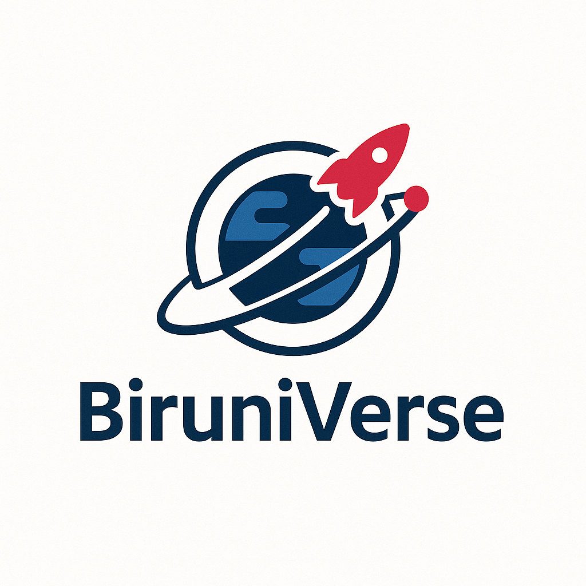

<h1 align="center">BiruniVerse Team</h1>

  

>  This repository documents the technical design, engineering processes, and development stages of our autonomous vehicle prototype. Built by three passionate engineering students, this robot is our gateway to the universe. United by creativity and curiosity, and supported by Birzeit University, we proudly present our journey in the WRO Future Engineers Challenge 2025.
## Content

* `t-photos` contains 2 photos of the team (an official one and one funny photo with all team members)
* `v-photos` contains 6 photos of the vehicle (from every side, from top and bottom)
* `video` contains the video.md file with the link to a video where driving demonstration exists
* `schemes` contains one or several schematic diagrams in form of JPEG, PNG or PDF of the electromechanical components illustrating all the elements (electronic components and motors) used in the vehicle and how they connect to each other.
* `src` contains code of control software for all components which were programmed to participate in the competition
* `models` is for the files for models used by 3D printers, laser cutting machines and CNC machines to produce the vehicle elements. If there is nothing to add to this location, the directory can be removed.
* `other` is for other files which can be used to understand how to prepare the vehicle for the competition. It may include documentation how to connect to a SBC/SBM and upload files there, datasets, hardware specifications, communication protocols descriptions etc. If there is nothing to add to this location, the directory can be removed.

# Table of Contents

1. [🏁 Competition Overview](#-competition-overview)
2. [👥 Who Are We?](#-who-are-we)
3. [🎯 Robot Aims and Objectives](#-robot-aims-and-objectives)
4. [🧠 Design Philosophy](#-design-philosophy)
5. [🛠️ Hardware Components](#-hardware-components)
6. [💻 Software Architecture](#-software-architecture)
7. [📐 CAD & Mechanical Design](#-cad--mechanical-design)
8. [⚙️ Electronics and Wiring](#-electronics-and-wiring)
9. [🚘 Motion Planning & Navigation](#-motion-planning--navigation)
10. [👁️ Sensor Integration](#-sensor-integration)
11. [🎮 Control Algorithms](#-control-algorithms)
12. [📊 Performance Metrics](#-performance-metrics)
13. [🧪 Testing and Iteration](#-testing-and-iteration)
14. [🐛 Challenges & Lessons Learned](#-challenges--lessons-learned)
15. [📷 Media Gallery](#-media-gallery)
16. [📁 Project Structure](#-project-structure)
17. [🔗 Useful Links](#-useful-links)
18. [📄 License](#-license)

## Introduction

_This section should explain what your codebase includes: the main modules (like motor control, line following, lap counter, etc.), how each is linked to physical components (like servo, motor, sensors), and instructions on compiling/uploading the code (e.g., using Arduino IDE or PlatformIO)._

## Team Photos

_A folder with two photos: one official and one funny showing the whole team._

## Vehicle Photos

_Six images showing the vehicle from all angles: front, back, left, right, top, and bottom._

## Video Demonstration

_Link to a demo video showing your robot navigating as per the task requirements._

## Schematics

_Images (PNG/JPEG/PDF) of your electromechanical diagrams showing how every component is wired or connected._

## Source Code

_All Arduino/Python/C++ code and libraries for sensors, motors, servos, etc._

## 3D/CNC Models

_STL, DXF, or other model files used for manufacturing vehicle parts. If not used, this section can be deleted._

## Other Documentation

_Includes manuals, connection instructions, SBC/ESP32 guides, datasets, protocols, or additional helpful content._
# Engineering Material
- Raspberri pi 4
- ESP-WROOM-32
- ESP32 expansion board
- H-bridge
- DC Mototr
- Servo Motor
- Infrared Sensor
- Color Sensor
- ultrasonics : we used 3 ultrasonics 2 on the sides and 1 in the front
