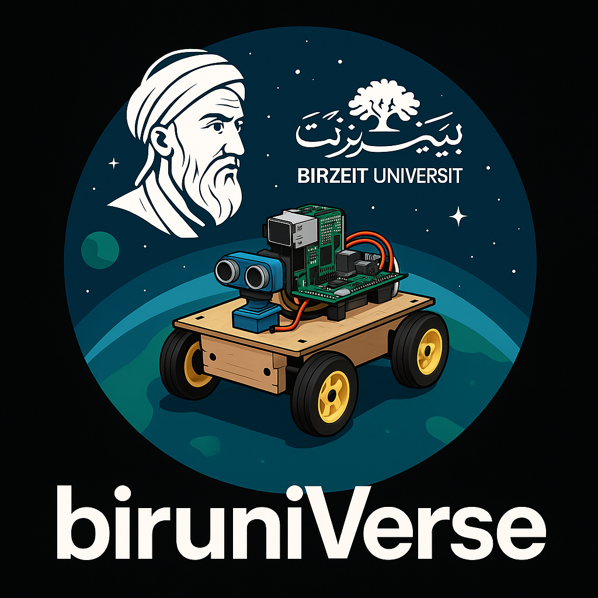
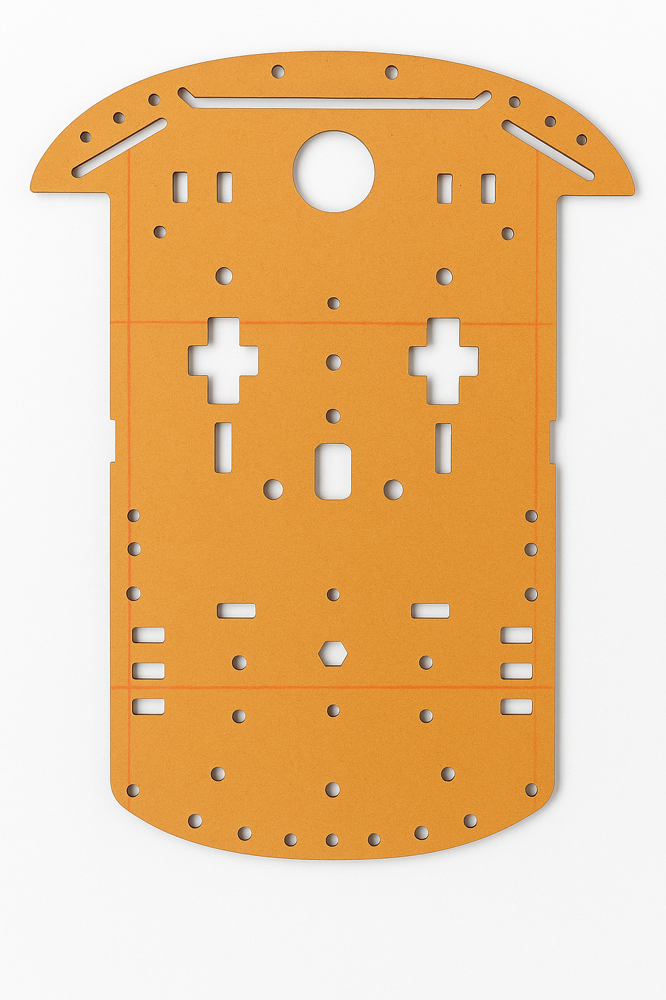

<h1 align="center">BiruniVerse Team</h1>

  

>  This repository documents the technical design, engineering processes, and development stages of our autonomous vehicle prototype. Built by three passionate engineering students, this robot is our gateway to the universe. United by creativity and curiosity, and supported by Birzeit University, we proudly present our journey in the WRO Future Engineers Challenge 2025.
## Content

* `t-photos` contains 2 photos of the team (an official one and one funny photo with all team members)
* `v-photos` contains 6 photos of the vehicle (from every side, from top and bottom)
* `video` contains the video.md file with the link to a video where driving demonstration exists
* `schemes` contains one or several schematic diagrams in form of JPEG, PNG or PDF of the electromechanical components illustrating all the elements (electronic components and motors) used in the vehicle and how they connect to each other.
* `src` contains code of control software for all components which were programmed to participate in the competition
* `models` is for the files for models used by 3D printers, laser cutting machines and CNC machines to produce the vehicle elements. If there is nothing to add to this location, the directory can be removed.
* `other` is for other files which can be used to understand how to prepare the vehicle for the competition. It may include documentation how to connect to a SBC/SBM and upload files there, datasets, hardware specifications, communication protocols descriptions etc. If there is nothing to add to this location, the directory can be removed.
# Table of Contents

## Introduction
- [ Competition Overview](#-competition-overview)
- [ Who Are We?](#-who-are-we)
- [ Robot Aims and Objectives](#-robot-aims-and-objectives)

##  Technical Design
- [ Design Strategy](#-design-strategy)
- [ Hardware Components](#-hardware-components)
- [ Software Architecture](#-software-architecture)

##  Development Process
- [ Assembly Process](#️-assembly-process)
- [ Testing and Iteration](#-testing-and-iteration)
- [ Performance Metrics](#-performance-metrics)

##  Documentation
- [ File Structure](#-file-structure)
- [ Robot Photos](#-robot-photos)
- [ Future Improvements](#-future-improvements)
- [ Lessons Learned](#-lessons-learned)
- [ References](#-references)

---

## Competition Overview

The World Robot Olympiad (WRO) challenges students to design and build autonomous robots.  
In the **Future Engineers** category, teams develop a self-driving car capable of navigating a randomized track using onboard sensors and control logic.  

The robot must be compact (**30 × 20 × 30 cm**) and operate fully without remote control.  
The goal is to replicate real-world autonomous driving, where the robot detects its environment, makes decisions, and completes laps reliably.  

Success is measured by both the robot’s performance on the track and the quality of the **engineering documentation** shared on GitHub, reflecting the full journey from design to competition-ready system.  

We chose to document our journey in the form of a story — step by step, from forming our team to building our final robot.  
Because in every line of code, every printed part, and every late-night fix, there is a story worth telling: a story of ideas turning into motion, and motion turning into achievement.  

##  Who Are We?

**spring 2025 – We came together.**  
Three students from different majors united with one goal: build a robot that goes beyond expectations.

-  **Alma Alkhader** – _Computer Engineer_  

-  **Aya Ghabbeish** – _Mechatronics Engineer_  

- **Sara Afifi** – _Mechanical Engineer_  

Together, we are **biruniVerse** — inspired by Birzeit and destined for the universe.

## Why BiruniVerse?

Our name **BiruniVerse** is built on two roots:  

- **Biruni** → A tribute to *Al-Biruni*, the great Muslim scholar and polymath, known for his groundbreaking contributions to science, astronomy, mathematics, and engineering. His curiosity and drive for discovery inspire us to push the limits of knowledge.  
- **Birzeituniversity (birUni)** → A proud reference to *Birzeit University*, our home, where this project was born. It connects our identity as students to a tradition of learning and innovation.  

The second part of our name, **Universe**, reflects our belief that through projects like these we are not only building robots — we are building the skills, imagination, and courage to reach for the universe itself.  

**BiruniVerse = Biruni + Birzeituni + Universe**  
A name that ties together heritage, identity, and aspiration.  

## Understanding the Challenge

Our journey began with the WRO 2025 Future Engineers rulebook, the document that defines every detail of the competition. Reading it gave us a clear picture of what the competition expected:  
a self-driving car that can complete laps on a randomized track, obey traffic rules with red and green pillars — all without human intervention.

After studying the rules, we joined training sessions at our university. There we met fellow participants, last year’s winners, coaches, and mentors. They encouraged us to ask questions, to experiment, and most importantly, to approach this as an engineering learning process, not just a race.

From there, we started exploring strategies and technical designs. We looked deeper into possible hardware parts that could be used, and we began asking specific questions to define our goals and shape our approach to solving the challenge.

##  Robot Aims and Objectives

- Detect obstacles using sensors and camera.  
- Avoid obstacles from the correct side.  
- Drive on its own without help.  
- Fix itself if it crashes or gets stuck.  
- Count laps and stop after finishing.  
- Stay inside size and hardware limits.

##  Design Strategy
_TBD_

## Hardware Design
### Design Strategy
For the foundation of our robot, we chose a standard plastic chassis
##  Design Strategy
For the foundation of our robot, we chose a standard plastic chassis

  

The reason behind choosing this base was driven by simplicity and practicality, it offered a flat, stable surface with numerous mounting holes, which helped with arranging and securing components.

However, our structural requirements were not entirely satisfied by that base, so we had to modify it to fit our design by:
**Custom Cuts**: we had to make new holes and gaps in the base to allowcleaner wire connection between the the upper controllers and the lower motors. Additionally, we made extra openings near the back to give the rear wheels enough clearance, and prevent them from hitting the base.

  

### Engineering Material
- Raspberri pi 4
- ESP-WROOM-32
- ESP32 expansion board
- H-bridge
- DC Mototr
- Servo Motor
- Infrared Sensor
- Color Sensor
- ultrasonics : we used 3 ultrasonics 2 on the sides and 1 in the front

##  Software Architecture
_TBD_

##  Assembly Process
_TBD_

##  Testing and Iteration
_TBD_

##  Performance Metrics
_TBD_

##  File Structure
_TBD_

##  Robot Photos
_TBD_

##  Future Improvements
_TBD_

##  Lessons Learned
_TBD_

##  References
_TBD_

