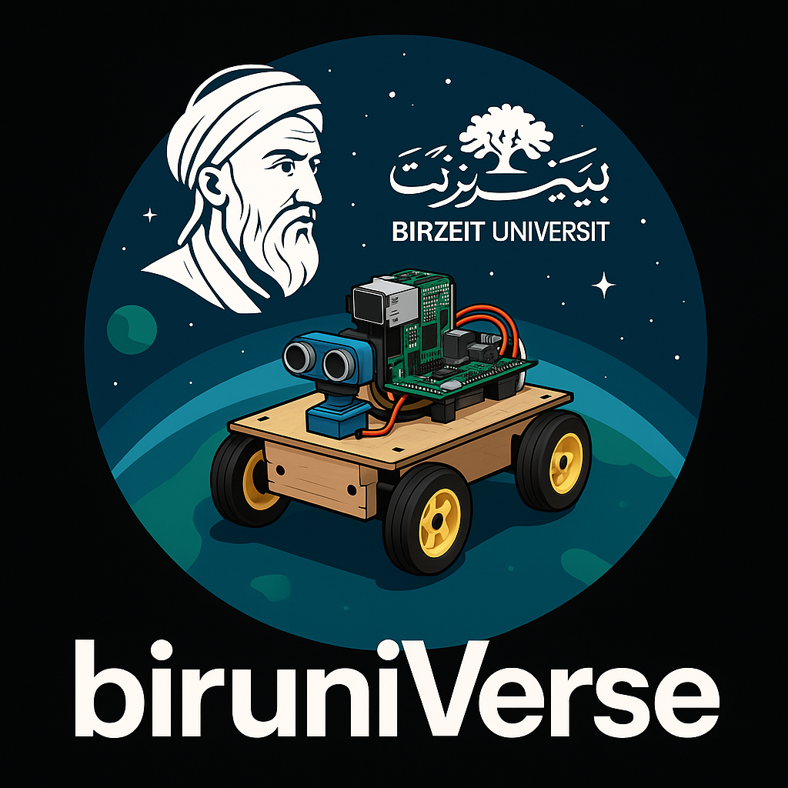

<h1 align="center">BiruniVerse Team</h1>

  

>  This repository documents the technical design, engineering processes, and development stages of our autonomous vehicle prototype. Built by three passionate engineering students, this robot is our gateway to the universe. United by creativity and curiosity, and supported by Birzeit University, we proudly present our journey in the WRO Future Engineers Challenge 2025.
## Content

* `t-photos` contains 2 photos of the team (an official one and one funny photo with all team members)
* `v-photos` contains 6 photos of the vehicle (from every side, from top and bottom)
* `video` contains the video.md file with the link to a video where driving demonstration exists
* `schemes` contains one or several schematic diagrams in form of JPEG, PNG or PDF of the electromechanical components illustrating all the elements (electronic components and motors) used in the vehicle and how they connect to each other.
* `src` contains code of control software for all components which were programmed to participate in the competition
* `models` is for the files for models used by 3D printers, laser cutting machines and CNC machines to produce the vehicle elements. If there is nothing to add to this location, the directory can be removed.
* `other` is for other files which can be used to understand how to prepare the vehicle for the competition. It may include documentation how to connect to a SBC/SBM and upload files there, datasets, hardware specifications, communication protocols descriptions etc. If there is nothing to add to this location, the directory can be removed.
# Table of Contents

## Introduction
- [ Competition Overview](#-competition-overview)
- [ Who Are We?](#-who-are-we)
- [ Robot Aims and Objectives](#-robot-aims-and-objectives)

##  Technical Design
- [ Design Strategy](#-design-strategy)
- [ Hardware Components](#-hardware-components)
- [ Software Architecture](#-software-architecture)

##  Development Process
- [ Assembly Process](#️-assembly-process)
- [ Testing and Iteration](#-testing-and-iteration)
- [ Performance Metrics](#-performance-metrics)

##  Documentation
- [ File Structure](#-file-structure)
- [ Robot Photos](#-robot-photos)
- [ Future Improvements](#-future-improvements)
- [ Lessons Learned](#-lessons-learned)
- [ References](#-references)

---

## Competition Overview

Students from all over the world come together to design, program, and test autonomous robots in the World Robot Olympiad (WRO), which is regarded as one of the top international robotics competitions. The Future Engineers challenge has a unique place in this international event because it encourages participants to work with cutting-edge robotics while firmly establishing the experience in useful, real-world engineering.

### Autonomous Driving Focus
Each team in the Future Engineers category uses onboard sensors and control logic to create a self-driving car that can navigate a randomly laid out track. 

### Adaptable Hardware and Software
Any materials, microcontrollers, and programming languages can be used by teams, enabling complete creativity in coding and electromechanical design.

### Compact Size Requirements
For the 2025 season, robots must not exceed 30 cm × 20 cm × 30 cm in size.

### The Process of Educational Engineering
The team's engineering documentation, which includes design choices, system diagrams, implementation procedures, and technical justifications shared on open platforms like GitHub, is evaluated by the competition in addition to the robot's performance.

### Real-World Engineering Experience
From ideation and prototyping to testing and solution presentation, Future Engineers replicates a real engineering workflow. Students get a firsthand look at what it's like to innovate and deal with uncertainty under actual technical limitations.

##  Who Are We?
_TBD_

##  Robot Aims and Objectives
_TBD_

##  Design Strategy
_TBD_

##  Hardware Components
_TBD_# Engineering Material
- Raspberri pi 4
- ESP-WROOM-32
- ESP32 expansion board
- H-bridge
- DC Mototr
- Servo Motor
- Infrared Sensor
- Color Sensor
- ultrasonics : we used 3 ultrasonics 2 on the sides and 1 in the front

##  Software Architecture
_TBD_

##  Assembly Process
_TBD_

##  Testing and Iteration
_TBD_

##  Performance Metrics
_TBD_

##  File Structure
_TBD_

##  Robot Photos
_TBD_

##  Future Improvements
_TBD_

##  Lessons Learned
_TBD_

##  References
_TBD_

