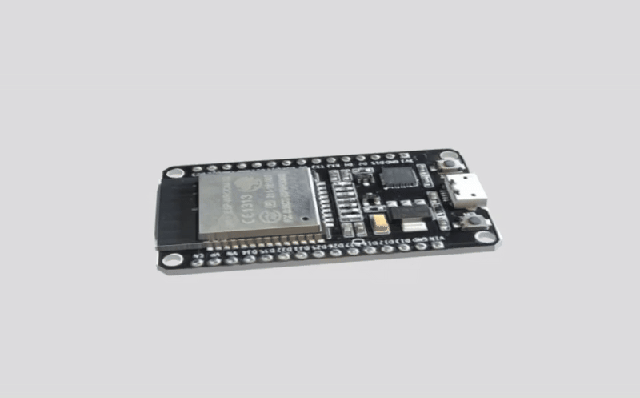
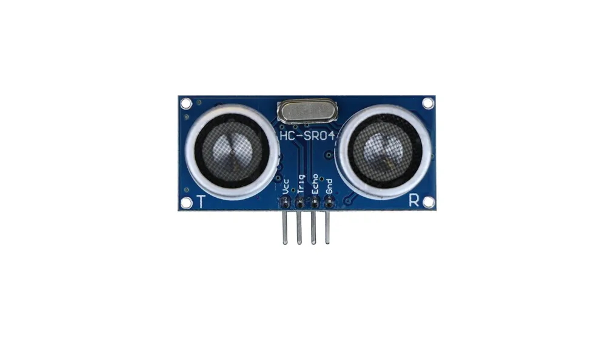
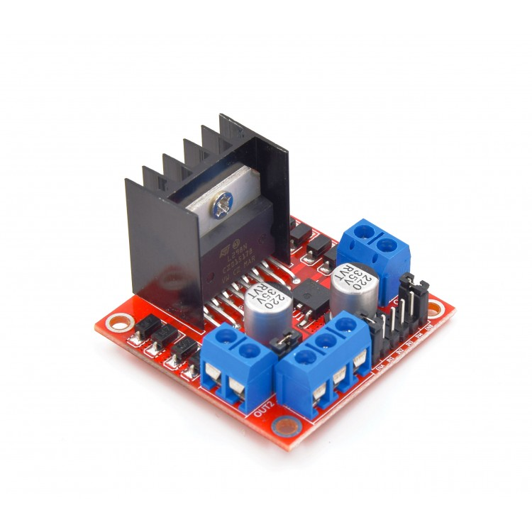

<h1 align="center">BiruniVerse Team</h1>

  

>  This repository documents the technical design, engineering processes, and development stages of our autonomous vehicle prototype. Built by three passionate engineering students, this robot is our gateway to the universe. United by creativity and curiosity, and supported by Birzeit University, we proudly present our journey in the WRO Future Engineers Challenge 2025.
## Content

* `t-photos` contains 2 photos of the team (an official one and one funny photo with all team members)
* `v-photos` contains 6 photos of the vehicle (from every side, from top and bottom)
* `video` contains the video.md file with the link to a video where driving demonstration exists
* `schemes` contains one or several schematic diagrams in form of JPEG, PNG or PDF of the electromechanical components illustrating all the elements (electronic components and motors) used in the vehicle and how they connect to each other.
* `src` contains code of control software for all components which were programmed to participate in the competition
* `models` is for the files for models used by 3D printers, laser cutting machines and CNC machines to produce the vehicle elements. If there is nothing to add to this location, the directory can be removed.
* `other` is for other files which can be used to understand how to prepare the vehicle for the competition. It may include documentation how to connect to a SBC/SBM and upload files there, datasets, hardware specifications, communication protocols descriptions etc. If there is nothing to add to this location, the directory can be removed.
# Table of Contents

## Introduction
- [ Competition Overview](#-competition-overview)
- [ Who Are We?](#-who-are-we)
- [ Robot Aims and Objectives](#-robot-aims-and-objectives)

##  Technical Design
- [ Design Strategy](#-design-strategy)
- [ Hardware Components](#-hardware-components)
- [ Software Architecture](#-software-architecture)

##  Development Process
- [ Assembly Process](#️-assembly-process)
- [ Testing and Iteration](#-testing-and-iteration)
- [ Performance Metrics](#-performance-metrics)

##  Documentation
- [ File Structure](#-file-structure)
- [ Robot Photos](#-robot-photos)
- [ Future Improvements](#-future-improvements)
- [ Lessons Learned](#-lessons-learned)
- [ References](#-references)

---

## Competition Overview

The World Robot Olympiad (WRO) challenges students to design and build autonomous robots.  
In the **Future Engineers** category, teams develop a self-driving car capable of navigating a randomized track using onboard sensors and control logic.  

The robot must be compact (**30 × 20 × 30 cm**) and operate fully without remote control.  
The goal is to replicate real-world autonomous driving, where the robot detects its environment, makes decisions, and completes laps reliably.  

Success is measured by both the robot’s performance on the track and the quality of the **engineering documentation** shared on GitHub, reflecting the full journey from design to competition-ready system.  

We chose to document our journey in the form of a story — step by step, from forming our team to building our final robot.  
Because in every line of code, every printed part, and every late-night fix, there is a story worth telling: a story of ideas turning into motion, and motion turning into achievement.  

##  Who Are We?

**spring 2025 – We came together.**  
Three students from different majors united with one goal: build a robot that goes beyond expectations.

-  **Alma Alkhader** – _Computer Engineer_  

-  **Aya Ghabbeish** – _Mechatronics Engineer_  

- **Sara Afifi** – _Mechanical Engineer_  

Together, we are **biruniVerse** — inspired by Birzeit and destined for the universe.

## Why BiruniVerse?

Our name **BiruniVerse** is built on two roots:  

- **Biruni** → A tribute to *Al-Biruni*, the great Muslim scholar and polymath, known for his groundbreaking contributions to science, astronomy, mathematics, and engineering. His curiosity and drive for discovery inspire us to push the limits of knowledge.  
- **Birzeituniversity (birUni)** → A proud reference to *Birzeit University*, our home, where this project was born. It connects our identity as students to a tradition of learning and innovation.  

The second part of our name, **Universe**, reflects our belief that through projects like these we are not only building robots — we are building the skills, imagination, and courage to reach for the universe itself.  

**BiruniVerse = Biruni + Birzeituni + Universe**  
A name that ties together heritage, identity, and aspiration.  

## Understanding the Challenge

Our journey began with the WRO 2025 Future Engineers rulebook, the document that defines every detail of the competition. Reading it gave us a clear picture of what the competition expected:  
a self-driving car that can complete laps on a randomized track, obey traffic rules with red and green pillars — all without human intervention.

After studying the rules, we joined training sessions at our university. There we met fellow participants, last year’s winners, coaches, and mentors. They encouraged us to ask questions, to experiment, and most importantly, to approach this as an engineering learning process, not just a race.

From there, we started exploring strategies and technical designs. We looked deeper into possible hardware parts that could be used, and we began asking specific questions to define our goals and shape our approach to solving the challenge.

##  Robot Aims and Objectives

- Detect obstacles using sensors and camera.  
- Avoid obstacles from the correct side.  
- Drive on its own without help.  
- Fix itself if it crashes or gets stuck.  
- Count laps and stop after finishing.  
- Stay inside size and hardware limits.

## Hardware Design

### 1. chassis Plate:

For the foundation of our robot, we chose a standard plastic chassis

  

The reason behind choosing this base was driven by simplicity and practicality, it offered a flat, stable surface with numerous mounting holes, which helped with arranging and securing components.

However, our structural requirements were not entirely satisfied by that base, so we had to modify it to fit our design by making new holes and gaps in the base to allow cleaner wire connection between the the upper controllers and the lower motors. Additionally, we made extra openings near the back to give the rear wheels enough clearance, and prevent them from hitting the base.

  

This picture shows how the chassis was cut to fit the wheels properly.
for the cutting process, we used a **silverflo 928D tool soldering and cutting tool**, we relied on its heated tip and fine control to carefully shape the chassis.

  

---

### 2. wheels:

#### Front Wheels

#### Starting Point – Store-Bought Wheels
We began with standard RC-style wheels that came with our chassis.  
These wheels consisted of:
- **Outer Tire**: black rubber with tread for grip.  
- **Plastic Hub**: inner white rim that holds the tire and connects to the axle.  

  

#### Problem – Wobbling During Rotation
During testing, we noticed a **wobbling problem** in the wheels.  

The issue was caused by:
- Loose fit between the wheel hub and the axle.  
- Lack of a proper rotational support structure.  

This wobbling reduced **stability, steering precision, and vehicle speed**.

  

#### Solution – Adding Bearings
To eliminate wobbling, we modified the wheels to include **ball bearings** (skateboard-style, model 608Z).

  

##### Why Bearings?
- Bearings allow the wheel to rotate smoothly around the axle.  
- They reduce friction, which increases efficiency.  
- They keep the wheel aligned and stable, preventing wobble.

### Front wheels assembly

1. **Outer Tire**  
   - Black part with tread made of rubber, providing grip on the track.  
   - Standard RC-style tire that slips over the wheel hub.  

2. **Wheel Hub (White Plastic Rim)**  
   - The inner white circular part that holds the tire.  
   - It was cut in some spots to fit the bearing.  

3. **Ball Bearing (608Z)**  
   - Standard skateboard/roller bearing.  
   - Allows the wheel to rotate smoothly around the axle with reduced friction.  

4. **Axle & Nuts Assembly**  
   - A metal threaded rod (axle) passes through the bearing.  
   - On the outside, nuts and washers fix the wheel in place to prevent wobbling.  
   - The threaded axle connects to the chassis, supported by mounts.
     

  

*Outside view showing tire, hub, bearing, axle, and nuts.*  

  

*Inside view of the same assembly.*  

We used this same technique for **both front wheels**, ensuring stability and smooth steering.

---

#### Rear Wheels

For the rear wheels, we initially planned to use wheels similar to the front ones. However, after upgrading to a **stronger DC motor**, we faced an issue: the motor’s torque and size caused the motor to hit the ground.  

To solve this, we switched to **larger rear wheels**:  

  

  

our inspiration for Small Front wheels + Large Rear came from **Tractors**: 
This setup mimics heavy machinery like **Tractors**, which use **smaller front wheels** and **larger rear wheels**:  
- The **smaller front wheels** make steering easier and more precise.  
- The **larger rear wheels** provide the **power and stability**, supporting the motor’s torque and carrying most of the load.
  
  

  

  

---

### 3. Steering Mechanism:
for our steering meachanism we followed the idea in this video: https://youtu.be/ZdtPTUsrAA4?si=SmZMQu09OpZvmOV_

We decided to recreate the steering parts using SoliWorks, so we could 3D print them with strong plastic for durability.

Our robot uses a servo-based steering system inspired by real car steering (Ackermann principle). The mechanism ensures both front wheels turn together when the servo moves.

####  steering system components

| Name                | Explanation | Picture |
|---------------------|-------------|---------|
| **Servo Motor**     | **Purpose:** The actuator that initiates steering.   **How it works:** The servo rotates a precise angle (controlled by the ESP32). |   |
| **Servo Horn**      | **Purpose:** The white plastic arm attached to the servo shaft.   **How it works:** When the servo rotates, the horn converts that into a small push–pull motion at its tip.   **Why needed:** Provides a lever arm so the servo’s rotation can be transferred into linear motion for the linkage rod. | |
| **Metal Link Rod**  | **Purpose:** Connects the servo horn to the first steering knuckle.   **How it works:** Moves back and forth as the horn rotates, converting the servo’s rotation into reciprocating linear motion.   **Why needed:** Acts as the bridge between the servo and the steering system. Without it, the servo could not move the knuckle. |   |
| **Steering Knuckle**| **Purpose:** Holds the wheel axle and connects to both the linkage rod and the tie rod.   **How it works:** It pivots around a vertical screw fixed to the chassis. When the linkage rod pushes/pulls, the knuckle rotates, turning the wheel axle left or right.   **Why needed:** Essential for steering — it allows the wheel to turn while still being free to spin for forward/backward motion. |  |
| **Tie Rod**         | **Purpose:** Connects the first steering knuckle to the second steering knuckle.   **How it works:** When the first knuckle pivots, the tie rod pushes or pulls the second knuckle so that both wheels turn together.   **Why needed:** Without it, only one wheel would steer, causing uneven turning and drag. The tie rod ensures synchronized steering. | |
| **Second Knuckle**  | **Purpose:** Mirrors the motion of the first knuckle through the tie rod.   **How it works:** Pivots when pulled/pushed by the tie rod, turning the second wheel.   **Why needed:** Ensures the second wheel turns in harmony with the first, giving stable and accurate steering. | |
| **Steering Mount Bracket (x2)** | **Purpose:** Connects the steering knuckle to the chassis with a vertical screw.   **How it works:** Acts as the pivot base for the knuckle.   **Why needed:** Keeps the knuckle rigidly fixed in place, allows free pivoting around the screw without wobbling. |   |
| **Spacer Block (x2)** | **Purpose:** Provides the required vertical clearance between the mount bracket and the knuckle.   **How it works:** Sits between the mount bracket and the steering knuckle; the screw passes through it.   **Why needed:** Prevents the knuckle from rubbing against the mount bracket. Aligns the linkage rod and tie rod at the correct height for smooth steering geometry. |  |

---

### 4. Gearbox:

For our drivetrain, we built a **simple right-angle gearbox**. 
Before designing our own gearbox, we studied gears from a toy car.  
The images below show the original toy car gears and their measurements, which served as inspiration for our custom build, which we then adjusted its measurements to match our motor and build needs.

These are the toy car gears we used as inspiration for our gearbox design:

| | | |
|---|---|---|
|  | |  |

#### Small Gear Component
- Length: **6 mm**  
- Gear teeth thickness: **3.2 mm** (but we required a larger outer diameter)  
- Motor mount diameter: **~3 mm** → the gear was hollowed out to fit this inner diameter.  
- Teeth count: **8 teeth**  
- Larger gear: **24 teeth**  
- Ratio: **1:3**  
- Special feature: the motor shaft is **D-shaped**, so the gear’s inner hole was designed with a matching **D-shaped cut** (not circular) to fit securely.

  

#### Large Gear Component
- Teeth count: **24 teeth**  
- Pitch diameter: **7.2 mm** (original design)  
- Outer diameter: **≤ 10 mm**  
- Inner hole: **3 mm circular cutout** (for mounting)  
- Thickness: *(as per final design — adjusted for stability)*

  

final setup :

  

These picture were taken before replacing the DC motor.
These specifications guided the CAD modeling of the gears and ensured they were compatible with both our motor shaft and the required torque transfer for the robot.

---

### 5.controllers

The microcontroller is the **brain of the robot**, so our main priority was choosing the best one to do the job while also being cost-effective.

- Our first option was the **Arduino Nano 33 BLE Sense Rev2**, which supports machine learning models and is affordable.  
  However, we couldn’t find it locally in Palestine, so we decided to replace it with a **Raspberry Pi**.

- When comparing Raspberry Pi versions, we eliminated the 5th version because of **power limitations**.  
  The 4th version had better internet resources, making it easier to learn, but introduced new challenges:  
  the motors and sensors required different voltages than the Raspberry Pi. Using multiple voltage regulators seemed risky.

- To solve this, we decided on a **hybrid approach**:  
  - Use an **ESP32** connected to the **H-bridge** to handle motors and sensors, ensuring stable voltage regulation.  
  - Use the **Raspberry Pi 4** exclusively for **object detection**, reducing its workload and improving efficiency.

This combination allowed us to balance cost, availability, and performance while ensuring smooth operation of both control and perception tasks.

#### Raspberry Pi 4

  

- **Processor**: 1.5GHz 64-bit quad-core  
- **RAM**: 8GB LPDDR4  
- **SD card**: 32GB 
- **Ports**: 2 USB 3.0 ports, 2 USB 2.0 ports
- **Operation Voltage** : 5.1V at 3A
- **Dimensions** : 85mm x 56mm x 17mm
- **Connectivity**:  
  - Dual-band Wi-Fi  
  - Bluetooth 5.0  
  - Gigabit Ethernet  
  - USB 3.0

***Purpose*** : The purpose of using the Raspberry Pi 4 was to connect a camera that provides visual input to the system. This input is then processed using machine learning, including image classification and recognition. Moreover, these methods guide the robot car to determine the turning direction based on live information and observations. In addition, the system can make decisions on the spot in a changing environment.

***Selection reason*** : As for the reason for choosing the Raspberry Pi 4, it is due to its easier-to-provide power source and lower power consumption. It is also more compatible when coding and using libraries. and lastly, its accessories are more affordable, and it generates less heat compared to the Raspberry Pi 5.

#### ESP32

  

***Purpose*** : its to connect the rest of the robots components, sensors and motors, to ensure their best performance, we programmed the microcontroller using C++, It connects to the Raspberry Pi, which handles image recognition. Based on camera input (red or green obstacle), the Raspberry Pi sends commands to the ESP32, which then executes movement based on the code the esp32 runs, through the connected hardware.

***Selection reason*** : The ESP32 has many captivating and suitable features for our project, it has processing power of Dual-core 32-bit Xtensa CPU, up to 240 MHz, it has both Wi-Fi and Bluetooth (Classic + BLE) built-in, enough memory (520KB) to handle our code and execute it smoothly, has PWM On most GPIOs, its more cost effective, and it has more advanced features.

#### ESP32 Expansion Board

<picture>
  
</picture>

- **Microcontroller**: ESP32 (dual-core, 240 MHz)  
- **Connectivity**: Wi-Fi + Bluetooth  
- **Operating Voltage**: 3.3V  
- **Programming**: Arduino IDE or MicroPython  
- **USB**: For power and programming (usually Micro-USB)  

***Purpose*** : Acts as the main controller for connecting sensors, processing inputs, and controlling outputs such as LEDs and motors.  

***Selection reason*** : Supports wireless communication, IoT applications, and runs code directly (Arduino/MicroPython). Flexible, powerful, and easy to integrate.  

---

---
### 6. sensors
#### Ultrasonic Sensor

<picture>
  
</picture>

**Model**: HC-SR04
**Voltage:** 5V DC  
**Current:** 15mA  
**Frequency:** 40Hz  
**Max Range:** 4m  
**Min Range:** 2cm  
**Measuring Angle:** 15°  
**Trigger Input:** 10µs TTL pulse  
**Echo Output:** TTL level signal (range proportional)  
**Dimensions:** 45 × 20 × 15 mm  

***Purpose*** : We have adopted a strategy that requires three ultrasonic sensors to be used effectively. Two sensors are placed on the sides, while the third is positioned at the front of the car. The side sensors are responsible for measuring the distance between the car and the walls on each side of the path. They continuously compare the two readings to determine the car’s position. When one of the side sensors detects a distance greater than the other by more than 2 meters, the system will determine that side as the turning direction of the path. As for the third sensor at the front, its main purpose is to measure the distance between the car and any obstacles, which will later be used to decide when the car should start turning at an angle to avoid collisions. It will also measure the distance between the walls of the track and the car, which will be useful—combined with our servomotor and camera in Task 2.

#### Infrared Sensor

<picture>
  
</picture>

- **Model**: TCRT5000  
- **Operating Voltage**: 3.3V – 5V  
- **Current Consumption**: ~18–20 mA  
- **Detection Range**: 2 mm – 15 mm (optimal within 2–10 mm)  
- **Output Signal**: Digital (HIGH/LOW) or Analog (depending on board version)  
- **Detection Type**: Reflective infrared (IR LED + phototransistor)  
- **Wavelength**: ~950 nm (IR emitter)  
- **Response Time**: <1 ms (fast switching)  
- **Adjustable Sensitivity**: Yes (via onboard potentiometer, if available)  
- **Indicator LEDs**: Power and output status  
- **Dimensions (module)**: ~3.2 cm × 1.4 cm (can vary by version)  

***Purpose*** : The purpose of this sensor is to detect short distances between the robot and its surroundings. While it may seem similar to the ultrasonic sensor, its main role is to provide an extra layer of safety to prevent collisions with obstacles or walls. It also helps the robot determine when to move backwards if needed.  

***Selection reason*** : It senses short distances more precisely than the ultrasonic sensor.  

#### Color Sensor

<picture>
  
</picture>

- **Model**: TCS3200 Color Sensor  
- **Operating Voltage**: 2.7V – 5.5V (typically 5V)  
- **Operating Current**: ~2.5 mA (average)  
- **Output Type**: Frequency (square wave) proportional to light intensity  
- **Sensing Element**: 8×8 array (64 photodiodes):  
  - 16 red filters  
  - 16 green filters  
  - 16 blue filters  
  - 16 clear (no filter)  
- **Selectable Output Frequency Scaling**: 100%, 20%, and 2%  
- **Measurement Range**: Full visible spectrum (RGB + clear)  
- **Response Time**: <100 ms typical  
- **Interface**: Digital output (no ADC needed)  
- **Detection Method**: Measures reflected light intensity of different colors  
- **Module Dimensions**: ~28 mm × 28 mm (may vary by version)  

***Purpose*** : Its main job is to detect either a green or orange line on the mat, which is used to count how many laps the robot car has completed. If it detects 12 orange lines, it means the car has finished 3 laps and should park (the mat has 4 orange lines at each corner, so 4 lines equal one lap). The color sensor also had another role in a different strategy: to determine the direction of the car (clockwise or counterclockwise). This was based on the color of the first line detected, which guided the system to track that color and decide turning direction, which was our initial stratege for counting laps before switching to a strategy that relies on sata from ultrasonic seneors.

***Selection reason*** : Provides reliable detection of specific colors, enabling lap counting and alternative navigation strategies.  

---

### 7. Motors:
#### Servo Motor

<picture>
  
</picture>

- **Model**:DCGM-N20-12V-EN-200RPM
- **Voltage**: 4.8V to 6V  
- **Operating Current**: ~100 mA to 250 mA (under load)  
- **Stall Torque**: 1.8 kg·cm at 4.8V  
- **Speed**: ~0.1 sec/60° at 4.8V  
- **Rotation Range**: 0° to ~180° (limited by internal stops)  
- **Control Signal**: PWM (50 Hz, 1–2 ms pulse width)  
- **Motor Type**: Brushed DC motor with control circuitry and feedback  
- **Weight**: ~9 g  
- **Dimensions**: 22.8 × 12.2 × 29.5 mm  
- **Gear Type**: Plastic gears  
- **Shaft Type**: Spline (21 teeth)  
- **Connector**: 3-pin (Signal, VCC, GND)  

***Purpose*** : Used in the robot car’s steering mechanism. In Task 2, it worked with the camera and Teachable Machine to avoid obstacles dynamically by adjusting angles gradually. In Task 1, it turned 90° at track edges with ultrasonic input to keep the car aligned.  

***Selection reason*** : Compact, affordable, easy to control, and accurate for 0°–180° rotation, making it ideal for steering.

### 8. Motor Drivers:

#### H-Bridge

<picture>
  
</picture>

- **Voltage**: 5V to 35V  
- **Logic Voltage**: 5V  
- **Continuous Current**: 2A per channel  
- **Peak Current**: 3A per chann
- **Channels**: 2 (dual H-Bridge)  
- **Speed Control**: PWM (ENA/ENB pins)  
- **Direction Control**: IN1, IN2, IN3, IN4  
- **Protection**: Thermal shutdown, current limiting  
- **Flyback Diodes**: Included  

***Purpose*** : The ESP32 cannot directly reverse motor direction, but an H-Bridge enables this through simple digital HIGH/LOW signals. It also supports braking and freewheeling modes, offering finer control. It acts as a power driver, handling higher motor currents safely.  

***Selection reason*** : Without an H-Bridge, a DC motor can only spin one way. The H-Bridge makes motor control safe, programmable, and reliable.  
 
- **Model**: ESP32-WROOM-32 
- **Board**: NodeMCU-ESP32 (ESP32 DEVKITV1)  
- **Chip**: ESP32 (Dual-core Xtensa LX6, up to 240MHz)  
- **Wi-Fi**: 802.11 b/g/n (2.4GHz)  
- **Bluetooth**: v4.2 BR/EDR + BLE  
- **RAM**: 520KB SRAM  
- **Flash**: 4MB (or 16MB, depending on variant)  
- **GPIO Pins**: 38 (including ADC, DAC, UART, SPI, I2C)  
- **USB**: Micro-USB (for power/programming)  
- **Operating Voltage**: 3.3V
- **Dimensions** : 18mm x 25.5mm x 3.1mm

---

### 9. Power:

Our robot uses two different power sources to separate the load between the control electronics and the computing unit:

1. **9V Rechargeable Li-ion Battery (6600mAh)**
   - **Purpose:** Powers the **H-Bridge motor driver** and the **ESP32 microcontroller**.  
   - **Reasoning:** The ESP32 and H-Bridge require stable DC input for motor control and logic-level operations.  
   - **Advantage:** Keeps the motor driving system and the low-power controller on a dedicated supply, avoiding interference from the Raspberry Pi’s higher power draw.  
 

<picture>
  
</picture>

 

2. **Billboard 10,000mAh Power Bank**
   - **Purpose:** Powers the **Raspberry Pi**.  
   - **Reasoning:** The Raspberry Pi demands higher current (via USB 5V) to handle computer vision and advanced processing tasks.  
   - **Advantage:** Provides long runtime with built-in overcharge protection and dual USB outputs, ensuring the Pi has a reliable and safe power source.  

<picture>
  
</picture>

---

By splitting the power supply:
- The **motors and ESP32** receive dedicated current without fluctuations.  
- The **Raspberry Pi** operates independently, focused on vision and processing.  
This design ensures **stability, efficiency, and longer runtime** for the robot.

---

### 10. Camera:

For vision processing, we equipped the robot with the **Microsoft LifeCam Cinema** USB camera.

- **Resolution:** 720p HD  
- **Interface:** USB 2.0  
- **Purpose:** Provides real-time video input for the **Raspberry Pi**, which runs computer vision algorithms for obstacle detection and navigation.  
- **Reasoning:**  
  - Affordable and easily available.  
  - Compact size, suitable for mounting on the robot chassis.  
  - Reliable driver support on Linux/Raspberry Pi OS.

<picture>
  
</picture>

----

## Strategies:

### First Task: Navigation Without Traffic Signs

For the first task of the WRO Future Engineers self-driving car challenge, our robot must navigate a track without traffic signs and complete **three laps**.  

1. **Wall-Following with Ultrasonic Sensors**
   - Two ultrasonic sensors are mounted on the left and right sides of the robot.  
   - On straight sections, the robot uses the sensor readings to maintain a centered position between the track walls.  
   - If one side is closer to the wall, the steering is adjusted to balance the readings and re-center the robot.

2. **Corner Detection**
   - When the robot approaches a corner, one ultrasonic sensor suddenly detects a **much larger distance** (open space).  
   - This change signals that a turn is required.  
   - On detecting a corner:
     - The robot briefly slows down or stops.  
     - The **servo motor** precisely steers the front wheels to execute the turn.  

3. **Lap Counting**
   - Each successful turn is counted as progress along the lap.  
   - After detecting **12 turns**, the robot concludes that **3 laps** have been completed.  
   - The robot then comes to a full stop.

**Key Points**
- **Ultrasonic sensors** ensure continuous wall detection and provide reliable corner identification.  
- **Servo steering** allows accurate maneuvering around corners.  
- **Turn-based lap counting** avoids the need for external markers and ensures consistent lap tracking.

---

### Second Task : Obstacle Avoidance

For the second task of the WRO Future Engineers self-driving car challenge, the robot must navigate a track while avoiding obstacles placed along the way.  

1. **Camera and Raspberry Pi (High-Level Control)**
   - A USB camera connected to the Raspberry Pi continuously captures frames.  
   - Each frame is processed by a **Teachable Machine Lite model** (`model.tflite` with `labels.txt`).  
   - Classification results determine the action:
     - **Red Block** → Raspberry Pi sends `L` (Left) via serial.  
     - **Green Block** → Raspberry Pi sends `R` (Right) via serial.  
     - **No Block / Other** → Raspberry Pi sends `F` (Forward).  
   - The Pi communicates commands to the **ESP32** through serial (TX/RX pins).  

2. **ESP32 and Actuators (Low-Level Control)**
   - The ESP32 interprets the commands from the Raspberry Pi.  
   - **L** → Servo motor steers the front wheels left.  
   - **R** → Servo motor steers the front wheels right.  
   - **F** → Motors continue forward using the H-Bridge driver.  

3. **Ultrasonic Sensors**
   - **Side ultrasonics**: Keep the robot centered on straights and detect corners (same logic as Task 1).  
   - **Front ultrasonic**: Measures distance directly ahead. If an obstacle is too close (e.g., < 15 cm), the robot stops, moves backwards, then avoids the obstacle in the correct way.  

4. **Lap Counting**
   - Just like in Task 1, each successful turn increments a counter.  
   - After **12 turns**, the robot concludes that 3 laps are complete and stops.  

**Key Points**
- **Dual-layer system**:  
  - Raspberry Pi handles **visual recognition and decision-making**.  
  - ESP32 + ultrasonic sensors handle **navigation, obstacle safety, and motor control**.  
- **Fail-safe operation**: If the camera fails to classify, the robot defaults to ultrasonic-based navigation.  
- **Stable execution**: The front ultrasonic ensures the robot never collides while reacting to visual cues.

## Software 
